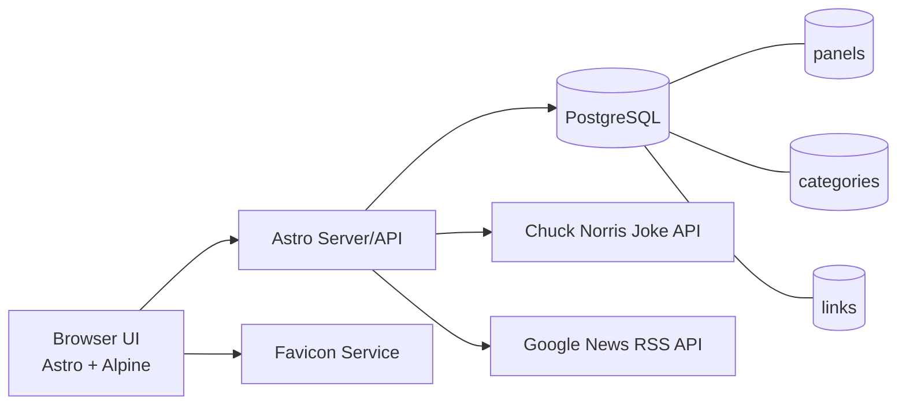

# Personal Dashboard
A personal  dashboard built with Astro + Alpine.js + PostgreSQL, containerized with Docker Compose.

## Table of Contents
- [Main Features](#main-features)
- [Tech Stack](#tech-stack)
- [Data Model (Current)](#data-model-current)
- [Architecture Diagram](#architecture-diagram)
- [Run with Docker](#run-with-docker)
- [Local Development](#local-development)
- [TODO](#todo)
- [Development Attribution](#development-attribution)
- [Environment Variables](#environment-variables)

## Main Features
- Personal profile header with:
  - `Name | Title | Email | Time TZ | Day, Month Date, Year | Categories Count | Links Count`
  - Chuck Norris joke line under the header
  - `+ Category` and `+ Link` modal-trigger buttons
- Dynamic panel system (tabs):
  - Panels are derived from categories (category lifecycle drives panel lifecycle)
  - Panel switcher with keyboard shortcuts (`1` to `9`)
  - Panel drag-and-drop supports both directions (before/after behavior)
- Category and link management:
  - Category create modal with inline duplicate-error messaging
  - Category delete blocked until all links in that category are deleted
  - Link create/edit modal with inline error messaging
  - Link description is optional
  - Duplicate link names are blocked globally across all categories
- Drag-and-drop with DB persistence:
  - Reorder panels, categories, and links
  - Drop links before/after other links
  - Move links across categories and across panels (drop on panel tabs)
- Search:
  - Link-name search from the top bar
  - Search scans links across categories
- Link visuals:
  - Auto-fetched favicon for each link
  - Fallback icon if site favicon is unavailable
- News pane:
  - Dedicated Google News Global pane (headline links + images)
  - Auto-refreshes independently (no full-page reload)
- World clocks:
  - Right-side analog clocks with live hands and digital `hh:mm:ss`
  - Cities: New York, Berlin, Chennai, Japan
- Theme and UX behavior:
  - Light/Dark theme toggle (bulb icon)
  - Theme persisted in `localStorage`
  - First-visit system-theme fallback
  - Theme applied pre-paint to avoid flash
  - Inactivity-based page reload timer
- Diagnostics and operations:
  - API/server logging for key operations
  - Dockerized runtime with PostgreSQL persistence

## Tech Stack
- Frontend: <a href="//ahastack.dev" target="_blank">Astro + HTMX + Alpine.js</a>
- Data: <a href="https://hub.docker.com/_/postgres" target="_blank">PostgreSQL</a>
- Runtime/Deployment: <a href="https://docs.docker.com/engine/install/ubuntu" target="_blank">Docker + Docker Compose</a>
- HostOS / Virtualization: Windows 11 / Hyper-V
- Linux Emulation: <a href="https://learn.microsoft.com/en-us/windows/wsl/install" target="_blank">WSL Ubuntu</a>

## Data Model (Current)
- `panels`: ordered tabs (`sort_order`)
- `categories`: belongs to panel (`panel_id`, `sort_order`)
- `links`: belongs to category (`category_id`, `sort_order`)

## Architecture Diagram


## Run with Docker
1. Copy env file:
   ```bash
   cp .env.example .env
   ```
2. Start:
   ```bash
   docker compose up --build --detached
   ```
2. Stop:
   ```bash
   docker compose down
   ```
3. Open:
   `http://<your_url>:8080`

## Local Development
```bash
npm install
npm run dev
```

## TODO
1. Integrate TLS/SSL.
2. Architecture needs to redesigned to 3-tier.

## Development Attribution
- Principal developer: Codex (GPT-5 coding agent).
- Collaboration model: iterative prompt-driven development in the local repo with incremental implementation, debugging, and UX refinement.

### Prompt Summary (Consolidated)
- Build a personal link dashboard with Astro + Alpine + PostgreSQL, Dockerfile, and Docker Compose.
- Variabilize `DATABASE_URL`; fix Astro connection reset and browser runtime errors.
- Remove old random-saying feature; add Chuck Norris joke line and control duplicate fetch behavior.
- Implement panelized architecture with dynamic panel lifecycle from categories.
- Add full CRUD for categories/links, modal-based create/edit UX, and logging visibility.
- Add drag-and-drop ordering for panels/categories/links with DB persistence, including cross-panel link moves.
- Add keyboard shortcuts (`1`-`9`) for panel switching and inactivity-based refresh.
- Add theme system: light/dark toggle, first-visit system fallback, pre-paint apply, and iterative dark-mode contrast tuning.
- Add favicon support with fallback graphic.
- Add world clocks (analog + digital), then multiple layout/styling passes to align pane sizing and responsiveness.
- Add Google News Global pane (headline links + images) with independent auto-refresh.
- Enforce data rules:
  - block duplicate link names globally
  - block category deletion until all links in that category are removed
- Continue iterative UI polish based on prompt feedback (buttons/icons, pane borders, spacing, shadows, and visibility).

## Environment Variables
See `.env.example` for all available variables.
