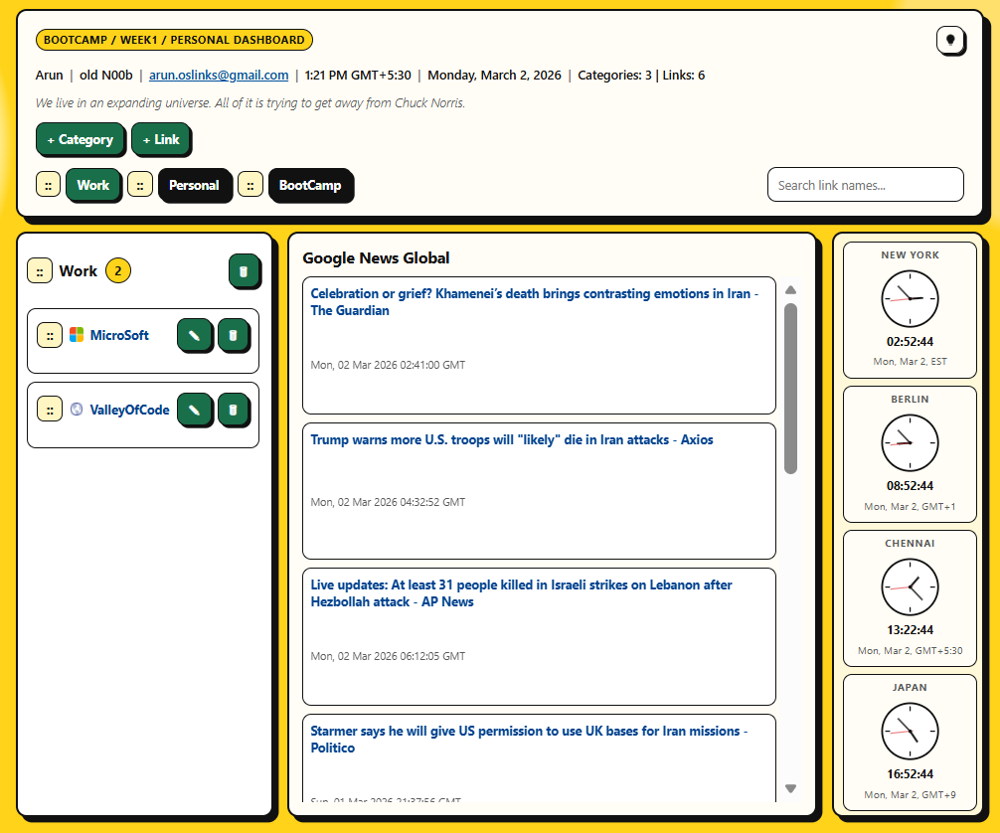
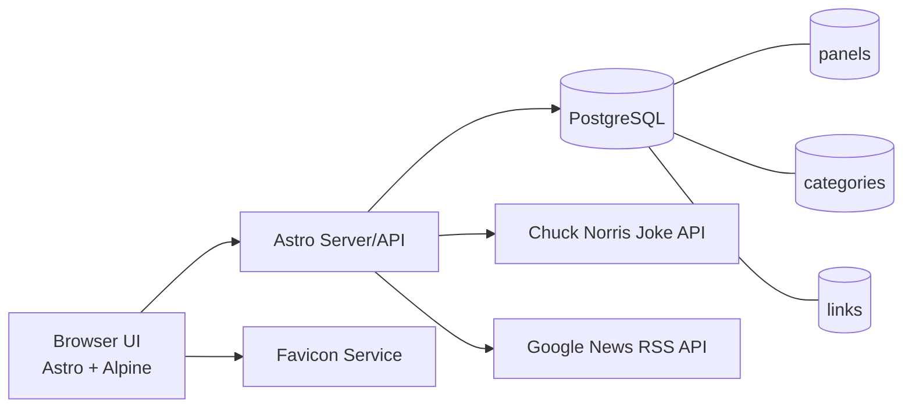

<a id="top"></a>

# Table of Contents
- [Description](#description)
- [Main Features](#main-features)
- [Tech Stack](#tech-stack)
- [Data Model (Current)](#data-model-current)
- [Architecture Diagram](#architecture-diagram)
- [Run with Docker](#run-with-docker)
- [Local Development](#local-development)
- [TODO](#todo)
- [Development Attribution](#development-attribution)
- [Environment Variables](#environment-variables)

## Description
A personal dashboard built with Astro + Alpine.js + PostgreSQL, containerized with Docker Compose.



[Back to top](#top)

## Main Features
- Personal profile header with:
  - `Name | Title | Email | Time TZ | Day, Month Date, Year | Categories Count | Links Count`
  - Chuck Norris joke line under the header
  - `+ Category` and `+ Link` modal-trigger buttons
  - `DB Backup/Restore` control beside the theme toggle
- Dynamic panel system (tabs):
  - Panels are derived from categories (category lifecycle drives panel lifecycle)
  - Panel switcher with keyboard shortcuts (`1` to `9`)
  - Panel drag-and-drop supports both directions (before/after behavior)
- Category and link management:
  - Category create modal with inline duplicate-error messaging
  - Category delete blocked until all links in that category are deleted
  - Link create/edit modal with inline error messaging
  - Link description is optional
  - Duplicate link names are blocked globally across all categories
- Drag-and-drop with DB persistence:
  - Reorder panels, categories, and links
  - Drop links before/after other links
  - Move links across categories and across panels (drop on panel tabs)
- Search:
  - Link-name search from the top bar
  - Search scans links across categories
- Link visuals:
  - Auto-fetched favicon for each link
  - Fallback icon if site favicon is unavailable
- News pane:
  - Dedicated Google News Global pane (headline links + images)
  - Auto-refreshes independently (no full-page reload)
- World clocks:
  - Right-side analog clocks with live hands and digital `hh:mm:ss`
  - Cities: New York, Berlin, Chennai, Japan
- Theme and UX behavior:
  - Light/Dark theme toggle (bulb icon)
  - Theme persisted in `localStorage`
  - First-visit system-theme fallback
  - Theme applied pre-paint to avoid flash
  - Shared button theme rules so new buttons inherit light/dark styling automatically
  - Inactivity-based page reload timer
- Diagnostics and operations:
  - API/server logging for key operations
  - Dockerized runtime with PostgreSQL persistence
  - Secret-protected manual database backup and restore from the dashboard
  - Restore picker limited to the five newest backups
  - Automatic deletion of older backup files when a new backup exceeds the five-backup cap
  - Post-restore restart-required lockout that greys out the dashboard until the app is restarted

[Back to top](#top)

## Tech Stack
- Frontend: <a href="//ahastack.dev" target="_blank">Astro + Alpine.js</a>
- Data: <a href="https://hub.docker.com/_/postgres" target="_blank">PostgreSQL</a>
- Runtime/Deployment: <a href="https://docs.docker.com/engine/install/ubuntu" target="_blank">Docker + Docker Compose</a>
- HostOS / Virtualization: Windows 11 / Hyper-V
- Linux Emulation: <a href="https://learn.microsoft.com/en-us/windows/wsl/install" target="_blank">WSL Ubuntu</a>

[Back to top](#top)

## Data Model (Current)
- `panels`: ordered tabs (`sort_order`)
- `categories`: belongs to panel (`panel_id`, `sort_order`)
- `links`: belongs to category (`category_id`, `sort_order`)

[Back to top](#top)

## Architecture Diagram


[Back to top](#top)

## Run with Docker
1. Copy env file:
   ```bash
   cp .env.example .env
   ```
2. Create the volumes and update your `.env` file accordingy:
   ```bash
   mkdir <db-vol-dir>; chown 70:70 <db-vol-dir>; chmod 700 <db-vol-dir>
   mkdir <dbbackup-vol-dir>
   cat >> .env << EOF
   DB_VOLUME=${pwd}/<db-vol-dir>
   DB_BACKUP_VOLUME=${pwd}/<dbbackup-vol-dir>
   EOF 
   ```
2. Start the stack from the repo root:
   ```bash
   docker compose up -f docker-compose.yml --env-file .env --build --detached
   ```
3. Open the dashboard:
   `http://localhost:8080`
   If you change `APP_PORT` in `.env`, use that port instead.
4. Stop the stack:
   ```bash
   docker compose -f docker-compose.yml --env-file .env down
   ```

[Back to top](#top)

## Local Development
The app source now lives under `docker/`.

```bash
cd docker
npm install
npm run dev
```

[Back to top](#top)

## TODO
1. Integrate TLS/SSL.
2. Architecture needs to redesigned to 3-tier.

[Back to top](#top)

## Development Attribution
- Principal developer: Codex (GPT-5 coding agent). _// old N00b 👴 assisted a bit_
- Collaboration model: iterative prompt-driven development in the local repo with incremental implementation, debugging, and UX refinement.

### Prompt Summary (2026-03-10)
- Add README back-to-top anchors without changing existing TOC anchors or contents.
- Implement manual PostgreSQL backup and restore from the dashboard, protected by an admin secret.
- Rename `.env_example` to `.env.example`, move the app source/build files under `docker/`, and update Docker Compose/build references.
- Verify backup/restore live in Docker, then fix PostgreSQL client/server version mismatch in the app image.
- Rename `DB Ops` to `DB Backup/Restore`, move the control beside the theme toggle, and switch restore from latest-only to selecting one of the five newest backups.
- Format restore names from backup timestamps, enforce a hard 5-backup retention cap, and delete older backups when new ones exceed that cap.
- Unify button theming so dark mode uses white button text and light mode uses green buttons with white text via shared theme variables.
- After restore, require a personal-dashboard restart, gray out the UI, block clicks, and keep the dashboard locked until the app restarts.
- Repeatedly rebuild, restart, and verify the app/database stack with `docker compose`.

### Prompt Summary (Consolidated)
- Build a personal link dashboard with Astro + Alpine + PostgreSQL, Dockerfile, and Docker Compose.
- Variabilize `DATABASE_URL`; fix Astro connection reset and browser runtime errors.
- Remove old random-saying feature; add Chuck Norris joke line and control duplicate fetch behavior.
- Implement panelized architecture with dynamic panel lifecycle from categories.
- Add full CRUD for categories/links, modal-based create/edit UX, and logging visibility.
- Add drag-and-drop ordering for panels/categories/links with DB persistence, including cross-panel link moves.
- Add keyboard shortcuts (`1`-`9`) for panel switching and inactivity-based refresh.
- Add theme system: light/dark toggle, first-visit system fallback, pre-paint apply, and iterative dark-mode contrast tuning.
- Add favicon support with fallback graphic.
- Add world clocks (analog + digital), then multiple layout/styling passes to align pane sizing and responsiveness.
- Add Google News Global pane (headline links + images) with independent auto-refresh.
- Enforce data rules:
  - block duplicate link names globally
  - block category deletion until all links in that category are removed
- Continue iterative UI polish based on prompt feedback (buttons/icons, pane borders, spacing, shadows, and visibility).

[Back to top](#top)

## Environment Variables
See `.env.example` for all available variables.

Manual database operations are controlled by:

- `DB_OPS_ENABLED`: enable the in-app backup/restore controls.
- `DB_OPS_SECRET`: required admin secret for backup/restore API calls.
- `DB_BACKUP_DIR`: backup directory inside the app container.
- `DB_BACKUP_VOLUME`: host path mounted to the backup directory.
- `DB_BACKUP_RETENTION_DAYS`: delete backups older than this after each successful backup.

With database ops enabled, use the `DB Backup/Restore` button in the dashboard to:

- Create an immediate PostgreSQL backup. Only the five most recent backup files are kept; creating a sixth or later backup deletes the older backup files.
- Restore one of the five most recent backup files, labeled from the backup timestamp as `day/month/year hours/minutes/seconds`.
- Restart the personal-dashboard after a restore so the restored database is picked up; the UI stays locked and mouse interaction is blocked until the app is restarted.

[Back to top](#top)
