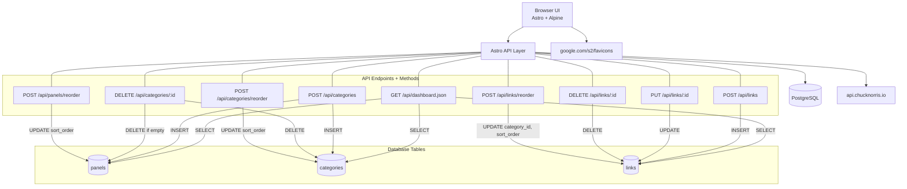

# Personal Link Dashboard
Personal dashboard built with Astro + Alpine.js + PostgreSQL, containerized with Docker Compose.

## Main Features
- Dynamic panels (tabs): panel lifecycle is tied to category lifecycle.
- Category creates a panel automatically; deleting that category removes the empty panel.
- Panel switcher at top with keyboard shortcuts: `1` to `9`.
- Drag-and-drop ordering with persistence:
  - Panels reorder (before/after).
  - Categories reorder inside current panel.
  - Links reorder before/after inside category.
  - Links move across categories and across panels (drop on panel tab).
- Profile header metadata:
  - `Name | Title | Email | Time TZ | Day, Month Date, Year`
- Random Chuck Norris joke displayed below header.
- Optional link description field.
- Inactivity auto-refresh timer.
- Light/Dark theme toggle with:
  - localStorage persistence
  - system-theme fallback on first visit
  - pre-paint theme application to avoid flash
- API/server logging for key operations.
- Persistent storage for PostgreSQL.

## Tech Stack
- Frontend: <a href="//ahastack.dev" target="_blank">Astro + HTMX + Alpine.js</a>
- Data: <a href="https://hub.docker.com/_/postgres" target="_blank">PostgreSQL</a>
- Runtime/Deployment: <a href="https://docs.docker.com/engine/install/ubuntu" target="_blank">Docker + Docker Compose</a>
- HostOS / Virtualization: Windows 11 / Hyper-V
- Linux Emulation: <a href="https://learn.microsoft.com/en-us/windows/wsl/install" target="_blank">WSL Ubuntu</a>

## Data Model (Current)
- `panels`: ordered tabs (`sort_order`)
- `categories`: belongs to panel (`panel_id`, `sort_order`)
- `links`: belongs to category (`category_id`, `sort_order`)

## Architecture Diagram


## Incremental Updates
- Panel drag-and-drop improved:
  - Panels can be reordered both left-to-right and right-to-left.
  - Drop logic supports before/after placement.
- Link drag behavior improved:
  - Links can be dropped before or after another link (based on drop position).
  - Cross-panel link moves supported by dropping links on panel tabs.
- Category header updated:
  - Removed category index display.
  - Shows only link count next to category name.
- Theme updates:
  - Theme toggle now uses a bulb icon.
  - Filled bulb in light mode, outlined bulb in dark mode.
  - Dark theme contrast tuned for better readability.
  - Dark mode supports first-visit system preference fallback.
- Link favicon support:
  - Favicon auto-fetched from link URL for existing and new links.
  - Fallback icon graphic shown when favicon is unavailable.
- Link form update:
  - Description field is optional.

## Run with Docker
1. Copy env file:
   ```bash
   cp .env.example .env
   ```
2. Start:
   ```bash
   docker compose up --build --detached
   ```
2. Stop:
   ```bash
   docker compose down
   ```
3. Open:
   `http://<your_url>:8080`

## Local Development
```bash
npm install
npm run dev
```

## TODO
1. Integrate TLS/SSL.
2. Architecture needs to redesigned to 3-tier.

## Development Attribution
- Principal developer: Codex (GPT-5 coding agent).
- Collaboration model: iterative prompt-driven development in the local repo with incremental implementation, debugging, and UX refinement.

### Prompt Summary (High-Level)
- Initial build: create a personal link dashboard using Astro/Alpine + PostgreSQL with Docker Compose.
- Core CRUD: add categories/links create/edit/delete flows with logging.
- Reliability fixes: resolve server connectivity/reset issues and environment variable wiring.
- Feature changes:
  - Remove random saying functionality.
  - Add dynamic panels and panel switcher behavior.
  - Add drag-and-drop ordering with DB persistence for panels/categories/links.
  - Add cross-category and cross-panel link movement.
  - Make link description optional.
  - Add favicon rendering for links with fallback icon.
- UX updates:
  - Redesign visual style and refine typography/layout.
  - Add date/time metadata line in header.
  - Add keyboard shortcuts (`1`-`9`) for panel switching.
  - Add inactivity auto-refresh behavior.
  - Add light/dark theme toggle with persistence and first-visit system fallback.
  - Tune dark mode colors, contrast, and icon behavior.
- Documentation updates:
  - Expand README features and operational details.
  - Add Mermaid architecture diagram.
  - Add API-method-to-table entity mapping.

## Environment Variables
See `.env.example` for all available variables.

